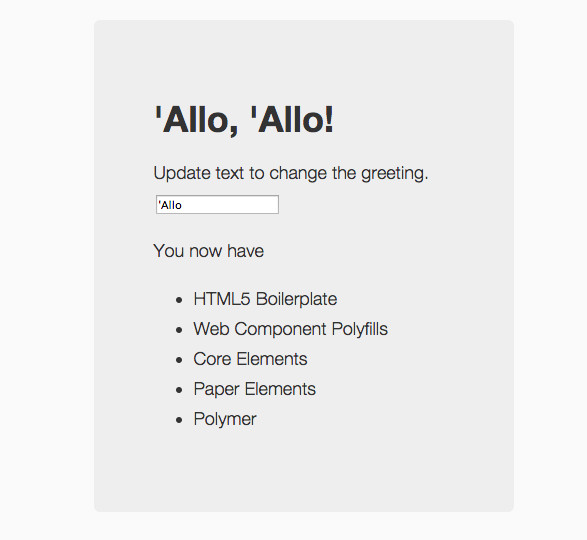

yolomer
=======

## Contents
  * [README samples](README.md)
  * [About Yolomer](#about-yolomer)
  * [Setup](#setup)
  * [Run](#run)
  * [Test](#test)
  * [Explore](#explore)
  * [Custom Elements](#custom-elements)


## About Yolomer

There are many ways to get started scaffolding a Polymer project, including the use of [Yeoman](http://yeoman.io/) which just acquired its very own [generator-polymer](https://github.com/yeoman/generator-polymer) project, maintained by the [Chrome Developer Relations](https://github.com/yeoman) team.

 Watch [Rob Dodson's](https://github.com/robdodson) video guide to Yolomer.

<a href="http://www.youtube.com/watch?feature=player_embedded&v=INH_OW4lFSs" target="_blank" align=center>
</a>


## Setup

The following was built/tested on a MacBook Air running OS X (version 10.0.4). [YMMV.](http://en.wiktionary.org/wiki/your_mileage_may_vary)


Install [Node Package Manager (npm)](https://github.com/npm/npm) if you haven't already done so. It now comes standard with [Node.js](http://nodejs.org/) and is a must-have tool for any serious web app developer. _We will use npm to bootstrap our Yeoman installation._

Install [Bower (bower)](http://bower.io/) for package management and [Grunt](http://gruntjs.com/) for build management if you haven't already done so. While its possible to use other packages for these needs, the  prescribed [Yeoman workflow](http://yeoman.io/assets/img/workflow.1bf8.jpg) shows this to be the most effective way to go.

Install [Yeoman (yo)](http://yeoman.io/learning/) if you haven't already done so. It is a web app scaffolding tool that has 'generators' (seed configurations) for various web app platforms. It is [maintained by](https://github.com/orgs/yeoman/people) members of the Chrome Developer Relations Team and others. 

```
npm install -g yo
```

Install [generator-polymer](https://github.com/yeoman/generator-polymer) also using npm.

```
npm install -g generator-polymer
```

Now create your directory for the new polymer project, cd into it, and scaffold out a new polymer project.

```
mkdir -p yolomer && cd $_
yo polymer
```
This should scaffold a _complete_ Polymer app. (Note that [other Polymer generators](https://github.com/yeoman/generator-polymer#generators) exist for other purposes.

The Yo scaffolding process asks a number of questions to configure your boilperplate. I stuck to defaults.

```
[?] Would you like to include core-elements? Yes
[?] Would you like to include paper-elements? Yes
[?] Would you like to use SASS/SCSS for element styles? Yes
[?] Would you like to use libsass? Read up more at 
https://github.com/andrew/node-sass#node-sass: No

 ..
 ..

I'm all done. Running bower install & npm install for you to install the required dependencies. If this fails, try running the command yourself.
```

At this point you are ready to build the project.

## Run

If all is well, you should now be able to run the simple web app using

```
grunt serve
```

This should run a local server hosting your web app, and launch a browser pointing to the default port on which the app is served. The result should look something like this.



Congratulations. Your yolomer scaffolding works. Now onwards into exploration!

## Test

You should also be able to run the basic tests provided by the scaffold using

```
grunt test
```

This should launch the browser as before, but now point to the _/test_ page showing the log output from the test runner. 

The scaffold contains default tests for the two defined elements ('yo_greeting' and 'yo_list'); to see the test code, look at the files in the 'test' directory within the scaffolded "app".

## Explore

Now that we've built, run and tested the project, lets take a look at what the scaffold provides by default. The root directory listing should contain these files:

```
.bowerrc
.editorconfig
.gitattributes
.gitignore
.sass-cache
.jshintrc
.yo-rc.json

Gruntfile.js
app
bower.json
node_modules
package.json
```

### Non application files 

First, lets's look at all the files outside the _app_ directory.

The [package.json](https://www.npmjs.org/doc/files/package.json.html)file declares _Node environment_ dependencies for that application. These dependencies when resolved, cause the related packages to be installed in the local _node\_modules_ directory. 

Similarly, the [bower.json](http://bower.io/docs/creating-packages/) declares _Application_ dependencies on plaform packages (e.g., in this case, dependencies on other Polymer packages). The _.bowerrc_ file specifies the location of the directory into which these dependencies are unpacked. 

Both these .json files are used by the _Grunt_ build tool (whose workflow automation is configured in _Gruntfile.js_)) to resolve dependencies and retrieve/update the necessary libraries or packages when building the application.

The .jshintrc file contains configuration options for [JSHint](https://github.com/jshint/jshint), the linter used to detect and fix errors in JavaScript code.

The [.yo-rc.json](http://yeoman.io/blog/cleanup.html) file is used to configure Yeoman options, but also as a marker that indicates (to Yeoman) the actual root directory of a scaffolded application.

The [.editorconfig](http://editorconfig.org) file allows developers to specify a consistent set of coding styles and guidelines across various IDEs they may use, assuming that the targeted IDE has a supported [EditorConfig Plugin](http://editorconfig.org/#download).

The [.gitattributes](http://git-scm.com/book/en/Customizing-Git-Git-Attributes) and [.gitignore](http://git-scm.com/docs/gitignore) files target configuration of the Git version control system, if or when that is leveraged for source control.

The [.sass-cache](http://stackoverflow.com/questions/13656630/what-are-the-files-in-sass-cache-for) folder is used by SASS to cache templates for performance optimization.

### Application files

Now, let's explore the contents of the _app_ directory.

```
.htaccess
404.html
bower_components
elements
favicon.ico
images
index.html
robots.txt
scripts
styles
test
```

The _bower_components_ directory (which is specified as the location for installing bower-managed dependencies in the .bowerrc file) contains all external (3rd party) application-level dependencies. By default, the 'yo polymer' scaffold includes _core_ and _paper_ elements, as well as the _Polymer_ library.

The [_robots.txt_](http://en.wikipedia.org/wiki/Robots_exclusion_standard), [.htaccess](http://en.wikipedia.org/wiki/.htaccess),[favicon.ico](http://en.wikipedia.org/wiki/Favicon) and [404.html](http://en.wikipedia.org/wiki/HTTP_404) pages provide placeholders for standard functionality associated with serving web content or interactive web apps. Update or replace them as relevant to your specific web app. _For most initial prototypes, these can be left unchanged._

The _styles_, _scripts_, _images_ and _test_ directories are also self-explanatory, meant to contain stylesheets (.css,.scss), standalone javascript code (.js), static image assets, and testing harnesses for this application respectively. _Again, for the initial steps, you will probably leave these unchanged._

The core application functionality itself is encapsulated in two items -- the _index.html_ file (which effectively serves as the entry point and container for your application) and the _elements_ directory (which effectively contains all the files required for the custom elements that your application is defining or using).

The _elements_ directory has a fairly simple layout. It contains an _element.html_ file at the root level, along with multiple sub-directories (one for each custom element defined within this application).

The _elements.html_ file contains the imports for any custom elements used by this application (as shown below) where the custom element may have been defined in this application or defined by a 3rd party (i.e., first declared as a dependency in bower.json).

```
<link rel="import" href="yo-list/yo-list.html">
<link rel="import" href="yo-greeting/yo-greeting.html">
```

In turn the _index.html_ (main entry point) can simply point to this elements.html file during the _vulcanize_ step of its build process. 

```html
  <!-- build:vulcanized elements/elements.vulcanized.html -->
  <link rel="import" href="elements/elements.html">
  <!-- endbuild-->
```

The ['vulcanize'](http://www.polymer-project.org/articles/concatenating-web-components.html) tool attempts to minimize the footprint of an application by methodically scanning imported elements, flattening their dependencies (and removing redundant ones), then concatenating them into a single file that potentially reduces the number of file requests the app needs to make at render time.


### Custom Elements

Custom elements are the 'core' value proposition of Web Components. By defining and implementing custom elements, you are effectively _extending_ the default web platform to support your functionality in a composable, modular and encapsulated manner.

The Yeoman scaffold will create a directory for each custom element inside the parent _elements_ directory, and create a default .html (template + script) and a .scss (style) file for that element within that subdirectory. 

To test this, try to create a custom element. In the root directory for the application (i.e., the parent directory containing app/), type in the following command to create a custom element called 'yo-custom'

```
yo polymer:el yo-custom

[?] Would you like an external SCSS file for this element? Yes
[?] Would you like to include an import in your elements.html file? Yes
   create app/elements/yo-custom/yo-custom.html
   create app/elements/yo-custom/yo-custom.scss
```

Note that the setup questions also ask if you want this newly created element to be added to the default imports in _elements.html_. The default response is "No" but in my example, I chose to override this to "Yes".

The result is the creation of a new subdirectory in elements/ called _yo-custom_, and the automatic import of that element in the _elements.html_ file. 

Now, you can include this "yo-custom" element in the app (index.html) as shown below and it should be automagically rendered in the app's single page.

```html
<body unresolved>
  <div class="hero-unit">
    <yo-greeting></yo-greeting>
    <p>You now have</p>
    <yo-list></yo-list>
    <yo-custom></yo-custom>
  </div>

  <!-- build:js scripts/app.js -->
  <script src="scripts/app.js"></script>
  <!-- endbuild-->
</body>
```

Of course, at present that element does nothing (since its template is empty) so let's correct that to show some text as indicated below (between BEGIN and END comments).

```html
  <template>
    <link rel="stylesheet" href="yo-custom.css">
    <!-- BEGIN: I just added this part -->
    <hr>
    <h2> This is a custom element, Yo! </h2>
    <hr>
    <!-- END: I just added this part -->
  </template>
```
Now running 'grunt serve' on your application should cause the additional line above to show up on the page.
